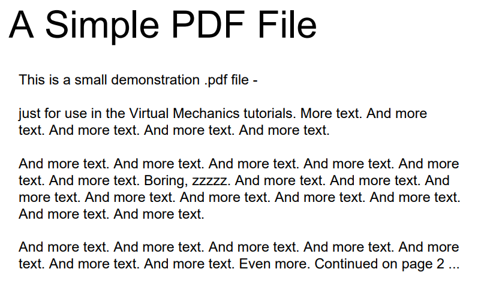
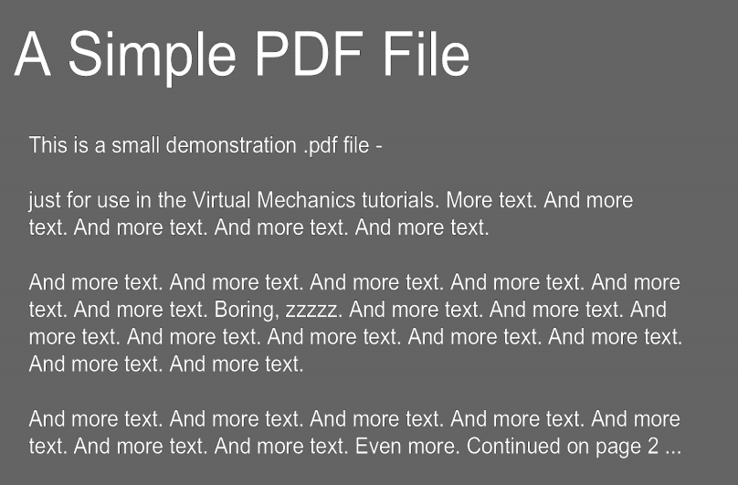

# PDF Dark Mode

## About 

### [Pypi page](https://pypi.org/project/PdfDarkMode/)

### _*NOTE:*_ This project is going under significant changes! Stay tuned for updates!

#### Python program that converts the white-space in PDF files to have a grey background.
#### Works best with non-handwritten PDF's and PDF's without any images.

#### Tested and working on Python 3.6+.

## Installation 
### Windows
- #### Requires [poppler-windows](https://https://github.com/oschwartz10612/poppler-windows) >= v20.12.1. It should work with older versions too but I haven't gone through and tested each one.
- #### Download [poppler for Windows from here.](https://https://github.com/oschwartz10612/poppler-windows/releases/tag/v22.04.0-0)

### macOS
* #### Mac users will have to install poppler for Mac. You can do so with this [homebrew formula.](https://formulae.brew.sh/formula/poppler)

### Linux
* #### Most linux distros already have ```pdftoppm``` installed. If not, you can check your package manager on how to install ```poppler-utils```.

### Then
### _*Using pip*_
* #### ``` pip install PdfDarkMode ```
### _*Or*_
* #### ``` git clone https://github.com/JustinTheWhale/PDF-Dark-Mode.git ```
* #### ``` cd PDF-Dark-Mode ```
* #### ``` pip install -r requirements.txt ```


## Usage
```python
from PdfDarkMode.darkmode import convert

convert("example.pdf")
```

#### Additionally, you can pass a list of PDF files instead of just one string like so: 

```python

from PdfDarkMode.darkmode import convert

convert(["example.pdf", "example2.pdf", ...])
```

#### You can also run it directly from the command line:

```python darkmode.py example.pdf example2.pdf ...```

## Example

